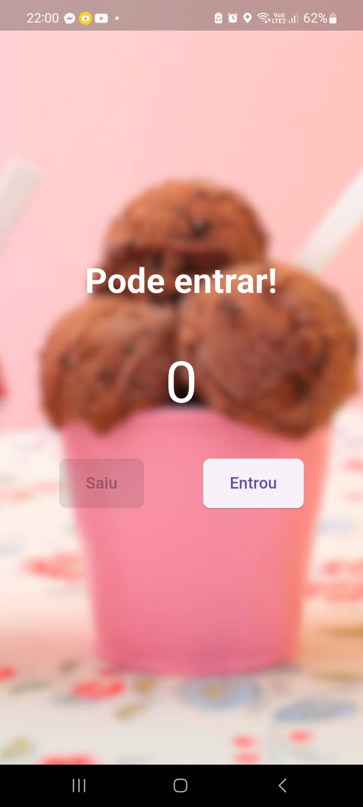
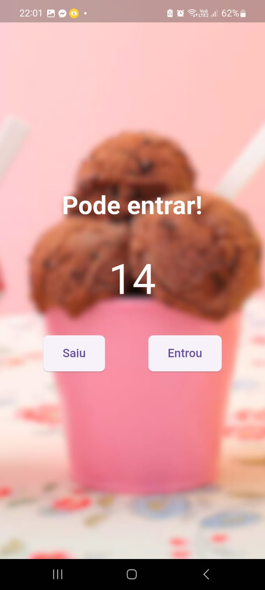
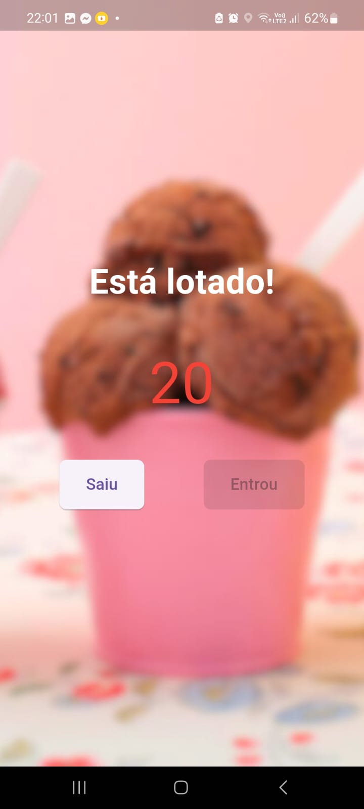

# people_counterr

This application is responsible for counting people inside of an ice-cream parlor. The main goal of this application is to learn
more about Flutter and get started with this technology.

---

## The face of the app:

You can see the initial screen of the application bellow:

It has a counter that starts with 0. It also has two buttons which are responsible for incrementing and decrementing the counter.

---

## Start counting people:

In the image bellow, you can see the counter incremented:

---

## The ice-cream parlor is fully of people:

When the counter is incremented by 20, the button "Entrou" is disabled to avoid more people! And the text also changes to "Está lotado!", that means the place is fully of people.

---

---

Developped with ❤️ by **João Lucas**

